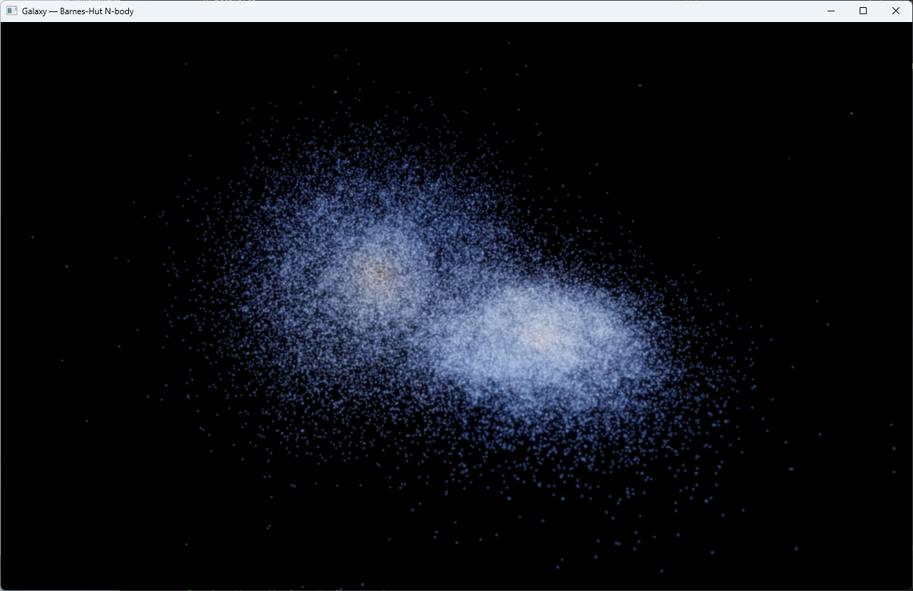

# Galaxy

A real-time 3D gravitational N-body sandbox written from scratch in Rust — a
spiral galaxy (or a two-galaxy collision) simulated body-by-body and rendered
with raw OpenGL.

No game engine. No physics library. No linear-algebra crate. The simulation core
has **zero external dependencies**; the only crates in the project exist to open a
window and talk to the GPU.



## What it actually does

Every star is an independent body under Newtonian gravity. With *N* stars a naive
solver costs *O(N²)* per step and dies well before it looks like a galaxy. This
uses a **Barnes-Hut octree** to approximate distant groups of stars by their
centre of mass, bringing each step down to *O(N log N)* and making ~10⁵ bodies
interactive on a normal multicore desktop.

The disk starts cold and rotating; small velocity dispersion seeds the
gravitational instabilities that wind up into spiral arms on their own. Nobody
draws the arms — they emerge.

## Highlights

- **Barnes-Hut octree** — arena-allocated nodes, centre of mass accumulated
  incrementally during insertion, depth cap against degenerate clustering.
- **Symplectic leapfrog** integrator (kick-drift-kick) — energy is conserved to
  ~0.003% over hundreds of steps instead of drifting away.
- **Dependency-free parallelism** — force evaluation is fanned across cores with
  `std::thread::scope`, no `rayon`.
- **Raw OpenGL renderer** (`glow`) — stars are soft additive point sprites,
  coloured by speed; an HDR bloom post-process gives the glow.
- **Hand-rolled math** — `Vec3` and a column-major `Mat4` (perspective, look-at).

## Build & run

Renderer (pulls `winit` / `glutin` / `glow` via the `render` feature):

```bash
cargo run --release --features render
```

Headless core verification (no GPU needed):

```bash
cargo run --release --bin verify
```

Requires a recent stable Rust toolchain (winit 0.29 / glutin 0.31), edition 2021.

## Controls

| Input        | Action                          |
|--------------|---------------------------------|
| left-drag    | orbit the camera                |
| mouse wheel  | zoom                            |
| `Space`      | pause / resume                  |
| `↑` / `↓`    | simulation speed (substeps/frame) |
| `B`          | toggle bloom                    |
| `M`          | switch single galaxy / merger   |
| `R`          | reset the current scene         |
| `Esc`        | quit                            |

## Verification

The `verify` binary checks the core against ground truth.

**Tree accuracy** — Barnes-Hut acceleration vs. direct O(N²) summation, N = 4000.
Error falls off cleanly with the opening angle θ, exactly as the approximation
predicts:

| θ    | mean rel. error | max rel. error |
|------|-----------------|----------------|
| 1.0  | 5.17%           | 127%           |
| 0.7  | 1.79%           | 22.4%          |
| 0.5  | 0.63%           | 5.2%           |
| 0.3  | 0.16%           | 1.5%           |

**Energy conservation** — N = 3000, 400 leapfrog steps, θ = 0.5:
total energy drift **0.0034%**. A non-symplectic integrator or an incorrect force
would visibly bleed energy; this does not.

**Throughput** — *O(N log N)* per step (single-threaded tree build + parallel
force evaluation); ~10⁵ bodies run interactively on a multicore desktop in a
release build.

## Layout

```
src/math.rs       Vec3 + column-major Mat4 (perspective, look_at)
src/octree.rs     Barnes-Hut octree (arena, incremental COM, depth cap)
src/sim.rs        SoA state + leapfrog; brute force & energy for tests
src/galaxy.rs     rotating-disk initial conditions; two-galaxy merger
src/parallel.rs   dependency-free scoped parallel-for
src/camera.rs     orbital camera
src/render.rs     glow point renderer + star shaders
src/post.rs       HDR scene target + bloom (bright-pass, separable blur, composite)
src/app.rs        window, GL context, main loop
src/bin/verify.rs headless core verification
```

## Tuning

In `app.rs`: `DiskParams.n` (star count), `Sim::new(.., dt, theta, eps)`. In the
renderer: `point_scale`, `brightness`; in post: bloom threshold and intensity.

## How it works (short version)

1. Build an octree over all stars; each node caches total mass and centre of mass.
2. For each star, walk the tree: if a node is far enough away (`size / distance < θ`),
   use its centre of mass as a single point; otherwise descend into its children.
3. Advance positions and velocities with leapfrog, reusing the previous step's
   acceleration for the first half-kick — this is what keeps energy stable.
4. Upload positions + speeds to the GPU and draw them as additive sprites; blur
   the bright parts and add them back for bloom.

## License

MIT.

## Support

If you found this project interesting or useful, you can support my work:

[](https://github.com/sponsors/makarov-mm)